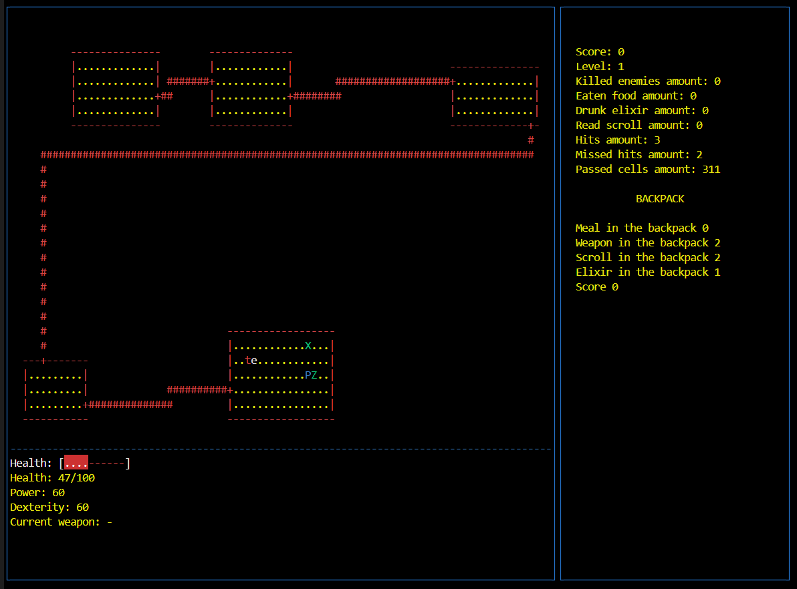

# RogueGame_Python
Implementation console Rogue Game in Python language

### Rogue

In Rogue, the player takes on the typical role of an adventurer found in early fantasy role-playing games. The game begins at the top layer of an unexplored dungeon filled with monsters and treasure. As players delve deeper into the randomly generated dungeon, the strength of the monsters increases, and the challenges escalate.

### Application Architecture
- Presentation Layer (View);
- Business Logic Layer (Domain, Business Logic);
- Data Access Layer.

Thus, the **presentation** layer contains code that organizes the logic for displaying information on the user's screen and accepting user inputs. 

The **domain** layer reflects the business logic of the application. In the current project, this includes defining the game-related entities—such as the game itself, the player, opponents, levels, the map, and others—as well as the game process logic.

The **data layer** in the application should be responsible for working with data. In this case, it will handle the storage of game history.

### The game application
The game application:
 - implemented in Python version 3.10;
 - has a console interface based on the curses library;

### Essential Game Entities
The main entities with basic attributes:
- Game Session;
- Level;
- Room;
- Corridor;
- Character:
  + Maximum Health,
  + Health,
  + Agility,
  + Strength;
- Backpack;
- Opponent:
  + Type,
  + Health,
  + Agility,
  + Strength,
  + Hostility;
- Item:
  + Type,
  + Subtype,
  + Health (amount of recovery, for food),
  + Maximum Health (amount of recovery, for scrolls and elixirs),
  + Agility (amount of increase, for scrolls and elixirs),
  + Strength (amount of increase, for scrolls, elixirs, and weapons),
  + Value (for treasures).

### Game Logic
- The game contains 21 levels of dungeons.
- Each level of the dungeon consists of rooms, connected by corridors.
- Each room may contain opponents and items.
- The player controls the character's movement, can interact with items, and fight opponents.
- The player’s goal is to find the exit to the next level at each level, thus completing all 21 levels.
- At each level, the player starts at a random position in the starting room, which is guaranteed to be free of opponents.
- With each new level, the number and difficulty of opponents increases, the number of useful items decreases, and the amount of treasure increases.
- After each attempt (successful or not), the player's result is recorded in a leaderboard, indicating the level reached and the amount of treasure collected. The leaderboard should be sorted by the amount of treasure.
- The entire game operates in a turn-based mode (each action of the player triggers actions from opponents).
- System for automatic adjustment to the player's level. If the player is easily passing levels, the difficulty should increase. If the player is facing difficulties, more useful items for the player can be added (for example, if the player often loses health — provide more health potions) and reduce the number and difficulty of enemies.

### Character Logic
- The health characteristics of the character display the current health level, and when the character's health drops to 0, the game should end.
- The maximum health level characteristic should indicate the maximum health level, which can be restored by consuming food.
- The agility characteristic should participate in calculating the probability of opponents hitting the character and vice versa, as well as influencing the speed of movement through the dungeon.
- The strength characteristic should determine the base damage dealt by the character without weapons and should also participate in damage calculations when using weapons.
- By defeating an opponent, the character earns a certain amount of treasure depending on the opponent's difficulty.
- The character can pick up items and store them in their backpack, and then use them.
- Each item upon use may temporarily or permanently change one of the character's attributes.

### Opponent Logic
- Each opponent has characteristics similar to the player's: health, agility, speed, and strength, in addition to the hostility characteristic.
- The hostility characteristic determines the distance from which the opponent begins to pursue the player.
- There are 5 types of opponents: 
  + Zombie (display: green z): Low agility. Medium strength, hostility. High health. 
  + Vampire (display: red v): High agility, hostility, and health. Medium strength. Decreases some maximum health of the player upon successful attack. The first attack on the vampire is always a miss. 
  + Ghost (display: white g): High agility. Low strength, hostility, and health. Constantly teleports around the room and periodically becomes invisible until the player engages in combat. 
  + Ogre (display: yellow O): Moves two cells around the room. Very high strength and health, but rests for one turn after each attack, then guarantees a counterattack. Low agility. Medium hostility.
  + Snake Mage (display: white s): Very high agility. Moves diagonally across the map, constantly changing direction. Each successful attack has a chance to "sleep" the player for one turn. High hostility.
  + Mimic enemy (display: white m) that imitates items. High agility, low strength, high health, and low hostility.
- Each type of opponent has its own movement pattern within the room.

### Environment Logic
- Each item type has its own value:
  + Treasure (have a value, accumulate, and affect the final rating);
  + Food (restores health by a certain amount);
  + Elixirs (temporarily increase one attribute: agility, strength, maximum health);
  + Scrolls (permanently increase one attribute: agility, strength, maximum health);
  + Weapons (have a strength characteristic; damage calculation changes when using weapons).
- When the character steps on an item, it should automatically be added to their backpack if it is not full (a backpack can hold a maximum of 9 items of each type).
- Food, elixirs, and scrolls are consumed upon use.
- Weapons drop on the floor when switched to an adjacent cell.
- Each level of the dungeon has a makeup that depends on its index: 
  + The deeper the level, the more challenging it is.
  + The level consists of rooms.
  + Rooms are connected by corridors.
  + Rooms contain opponents and items.
  + Opponents and the character can move through rooms and corridors.
  + Each level has a guaranteed exit to the next level.
  + Exiting the last level ends the game.

### Combat Logic
- Combat is calculated in a turn-based mode.
- Attacks are made by moving the character in the direction of the opponent.
- Combat is initiated upon contact with the enemy.
- Strikes are calculated in stages:
  + Stage 1 — hit check. The hit check is random and is calculated based on the agility and speed of both the attacker and the target.
  + Stage 2 — damage calculation. This is based on strength and modifiers (weapons).
  + Stage 3 — damage application. Damage is subtracted from health. If health drops to 0 or below, the opponent or player dies.
- Each opponent drops a random amount of treasure upon defeat, depending on their hostility, strength, agility, and health.

### Generated World

- Each level is logically divided into 9 sections, each generating a room of random size and position.
- Rooms are randomly connected with corridors. Corridors have their own geometry and can also be walked on. 
- At each level, one room is marked as the starting room, and another as the final room. 

### Display 
- Rendering the environment — walls, floor, doorways in walls, corridors between rooms.
- Rendering actors — the player, opponents, collectible items.
- Rendering the interface — displaying the game interface (status panel, inventory, simple menu).
- Fog of war — rendering scene dependencies based on game state:
  + Unexplored rooms and corridors are not displayed.
  + Explored rooms not containing the player are displayed only as walls.
  + In the room where the player is located, walls, floors, actors, and items are displayed.
  + When close to a room from the corridor, the fog of war dissipates only around the line of sight (using the Ray Casting algorithm and Bresenham's algorithm for determining the visible area).

### Control
- Player movement control:
  + Move using the WASD keys.
  + Use weapons from the backpack with the key 'h'.
  + Use a health potion from the backpack with the key 'j'.
  + Use an elixir from the backpack with the key 'k'.
  + Use a scroll from the backpack with the key 'e'.
- Any use of items from the backpack should print a list of items of that type on the screen, asking the player to choose (1-9).

### Statistics
- The game collects and displays a separate view of statistics for all playthroughs, sorted by the amount of treasure collected: amount of treasure, level reached, number of opponents defeated, amount of food consumed, number of elixirs consumed, number of scrolls read, number of hits made and missed, number of cells traversed.

## Game storage
**data layer**, which will save and retrieve player game progress data in a ``json`` file.
- After completing each level, the obtained statistics and the number of completed levels must be saved.
- Upon restarting the game, levels should be generated according to saved information, and the player's progress should be completely restored (accrued points, current attribute values).
- This file should also store statistics on all attempts at playthroughs.

